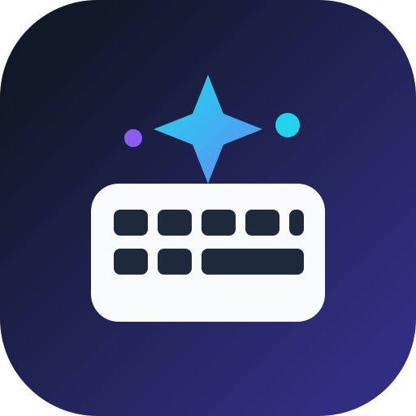

  

<h1 align="center">KI Tastatur</h1>

<strong>Schreiben. Verstehen. Verbessern. Direkt auf der Tastatur.</strong>

  <a href="https://github.com/JeffChecker/type/releases/tag/ki-tastatur-beta-v3"><strong>Beta v3 herunterladen</strong></a>

## Deine Tastatur kann jetzt mehr als tippen

KI Tastatur verbindet eine vollwertige Android Tastatur mit einem intelligenten Schreibassistenten. Du schreibst wie gewohnt und entscheidest selbst, wann die KI helfen soll.

Ein Tastendruck genügt, um einen Text zu korrigieren, verständlicher zu machen, den Stil zu ändern, einen Prompt zu verbessern oder Inhalte zu übersetzen. Dabei soll der Text nicht künstlich oder nach KI klingen, sondern natürlich und menschlich.

## Die wichtigsten Funktionen

### KI Korrektur

Mit **KI korrigieren** wird zuerst markierter Text verwendet. Ohne Markierung versucht die Tastatur den aktuellen Absatz zu erfassen. Falls ein Textfeld Absätze nicht sauber liefert, nutzt sie automatisch den aktuellen Satz oder den Textblock vor dem Cursor. Dadurch funktioniert die Korrektur auch in mehr Apps zuverlässig. Die KI berücksichtigt Zusammenhang, Sinn, typische Diktierfehler und missverständliche Formulierungen.

Die Korrektur startet ausschließlich auf Knopfdruck. Es gibt keine automatische Änderung während du noch schreibst oder nachdenkst. Eigene Satzzeichen wie `!`, `?`, `?!`, `!!` und `…` sollen erhalten bleiben.

### Stil auf Knopfdruck

Über **Stil** kannst du denselben Inhalt passend zur Situation umformulieren. Zum Beispiel:

**Freundlich · Professionell · Geschäftlich · Stilvoll · Locker · Humorvoll · Sarkastisch · Flirtend · Verführerisch · Direkt · Kurz · Einfache Sprache · Du Form · Sie Form**

Die Stilprompts sind bewusst auf natürliche Sprache ausgelegt. Unnötige KI Floskeln, künstlich glatte Formulierungen und überflüssige Gedankenstriche werden vermieden.

### Prompt+

Aus einer groben Idee wird ein klarer Prompt. **Prompt+** erkennt Ziel, Kontext, gewünschtes Ergebnis und wichtige Vorgaben und strukturiert den Text so, dass KI Systeme ihn besser verstehen können, ohne neue Fakten zu erfinden.

### Übersetzen

Texte können direkt aus der Tastatur übersetzt werden. Die Ausgangssprache wird automatisch erkannt. Als Ziel wird die aktuell aktive Tastatursprache verwendet.

Die Übersetzung arbeitet in Beta v3 hybrid. Mit einem eigenen **Google Cloud Translation API Schlüssel** wird für höhere Qualität und eine deutlich größere Sprachauswahl Google Cloud Translation verwendet. Ohne Cloud Schlüssel oder im Inkognito Modus fällt die Tastatur auf **Google ML Kit** auf dem Gerät zurück. Die Zielsprache kann der aktiven Tastatursprache folgen oder aus der von Google gelieferten Sprachliste gewählt werden.

### Freie Wahl des KI Anbieters

KI Tastatur unterstützt derzeit:

- **OpenAI**
- **Google Gemini**
- **Anthropic Claude**
- **Groq**

Jeder Anbieter erhält seinen eigenen API Schlüssel. Die Modellkonfiguration ist direkt auf der Hauptseite der App sichtbar. Dort kannst du Anbieter, API Schlüssel und Modell einstellen, aktuelle Modelle laden und die Verbindung testen. Die verfügbaren Modelle werden direkt über die jeweilige API geladen.

## Für Diktat genauso gedacht wie für Tippen

Gerade Spracheingabe produziert häufig kleine Fehler, fehlende Satzzeichen oder falsche Wörter. KI Tastatur kann solche Texte nach dem Diktieren auf Knopfdruck als Ganzes prüfen und sinnvoll überarbeiten.

## Datenschutz

Passwortfelder, sensible Eingaben und Inkognito Felder werden nicht an eine Cloud KI gesendet. Für Korrektur, Stil oder Prompt+ wird nur der Text an den Anbieter übertragen, den du selbst eingerichtet hast. Cloud Übersetzungen werden nur im Google Cloud Modus an Google Translate gesendet. Im Inkognito Modus bleibt die Übersetzung lokal.

API Schlüssel werden nicht in der App mitgeliefert und nicht im öffentlichen Quellcode hinterlegt.

## Installation

1. Lade **KI Tastatur Beta v3** aus den GitHub Releases herunter.
2. Installiere die APK.
3. Aktiviere KI Tastatur in den Android Einstellungen.
4. Lege sie als Eingabemethode fest.
5. Öffne die KI Einstellungen.
6. Wähle OpenAI, Gemini, Claude oder Groq.
7. Trage deinen eigenen API Schlüssel ein.
8. Lade die verfügbaren Modelle und wähle eines aus oder nutze `auto`.
9. Teste die Verbindung.

> Beta v3 ist eine Testversion. Schwerpunkt dieser Version ist die neue Hybrid Übersetzung mit Google Cloud Translation, dynamischer Sprachliste und Offline Fallback über ML Kit.

## Technische Basis

KI Tastatur basiert auf dem Open Source Projekt **FlorisBoard** und wird auf Grundlage der **Apache License 2.0** weiterentwickelt.

Originalprojekt: https://github.com/florisboard/florisboard

Die sichtbare Produktbezeichnung dieser Variante ist **KI Tastatur**. FlorisBoard bleibt als technische Herkunft und Lizenzquelle genannt.
