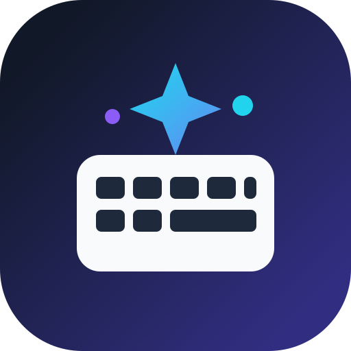

  

<h1 align="center">KI Tastatur</h1>

<strong>Schreiben. Verstehen. Verbessern. Direkt auf der Tastatur.</strong>

  <a href="https://github.com/JeffChecker/type/releases/tag/ki-tastatur-beta-v6"><strong>Beta v6 herunterladen</strong></a>

## Texte verstehen statt Wörter austauschen

KI Tastatur verbindet FlorisBoard mit einer KI Schreibassistenz. Du schreibst wie gewohnt und entscheidest selbst, wann die KI helfen soll.

Beta v6 prüft einen markierten Text oder den aktuellen Absatz als zusammenhängende Aussage. Die KI liest zuerst den vollständigen Text, ermittelt Sinn, Empfänger, Ton und gewünschte Handlung und prüft danach die einzelnen Sätze im Zusammenhang. Holprige, verdrehte oder durch Diktat falsch erkannte Sätze dürfen vollständig neu formuliert werden. Fakten, Namen, Zahlen, Termine, Fragen und Forderungen sollen dabei erhalten bleiben.

Die Korrektur startet ausschließlich auf Knopfdruck. Bewusst gesetzte Satzenden wie `!`, `?`, `?!` oder `…` bleiben erhalten. Ein fehlender normaler Punkt darf ergänzt werden, wenn der Satz dadurch grammatisch vollständig wird.

## Stil auf Knopfdruck

Über **Stil** kann derselbe Inhalt passend zur Situation neu formuliert werden:

**Freundlich · Professionell · Geschäftlich · Stilvoll · Locker · Humorvoll · Sarkastisch · Flirtend · Verführerisch · Persönlich · Direkt · Kurz · Einfache Sprache · Du Form · Sie Form**

Jeder Stil beginnt mit derselben Sinnprüfung. Erst danach wird der gewünschte Ton umgesetzt. Humor soll aus dem vorhandenen Zusammenhang entstehen. Persönliche Texte sollen individuell statt austauschbar wirken. Geschäftliche und professionelle Texte sollen klar und menschlich bleiben. Typische KI Floskeln, künstliche Einleitungen und unnötige Gedankenstriche werden vermieden.

## Prompt+

**Prompt+** liest einen Rohentwurf vollständig, erkennt Ziel, Kontext, Anforderungen und gewünschtes Ergebnis und macht daraus einen direkt nutzbaren KI Prompt. Fehlende Tatsachen werden nicht erfunden.

## OpenAI direkt mit ChatGPT verbinden

Beta v6 unterstützt den offiziellen OpenAI Ablauf **Sign in with ChatGPT** für Open Source Anwendungen.

Damit kann ein berechtigter ChatGPT Nutzer sein ChatGPT Konto direkt mit der Tastatur verbinden. Die Tastatur erhält nach Zustimmung OAuth Zugangsdaten. Ein OpenAI API Schlüssel muss für diese Zugangsart nicht in der App eingetragen werden.

Alternativ bleibt die bisherige OpenAI API Schlüssel Nutzung vollständig erhalten. In den KI Einstellungen kann zwischen **ChatGPT Plan** und **API Schlüssel** gewechselt werden.

Die ChatGPT Anmeldung verwendet den Systembrowser, PKCE, State und Nonce Prüfung sowie die von OpenAI dokumentierten OAuth Endpunkte. KI Anfragen über die ChatGPT Plan Freigabe werden mit `store: false` und `stream: true` an die öffentliche OpenAI Responses API gesendet.

## Weitere KI Anbieter

Zusätzlich werden weiterhin unterstützt:

* **Google Gemini** über einen eigenen Gemini API Zugang
* **Anthropic Claude** über einen eigenen Claude API Zugang
* **Groq** über einen eigenen Groq API Zugang

Die Anbieter werden bewusst nicht über inoffizielle Webseiten Automation angebunden. Wenn ein Anbieter keine offizielle Freigabe eines normalen Chat Abos für Drittanbieter Apps vorsieht, verwendet KI Tastatur dessen offizielle Entwickler Schnittstelle.

## Automatische Modellwahl

Mit `auto` lädt die Tastatur die für den gewählten Zugang tatsächlich verfügbaren Modelle. Bei OpenAI mit ChatGPT Login wird die Modellliste des angemeldeten ChatGPT Kontos verwendet. Bei API Zugängen wird die jeweilige API Modellliste geladen.

Modelle können auch manuell gewählt und die Verbindung direkt in der App getestet werden.

## Übersetzen

Texte können direkt über den ausgewählten KI Anbieter übersetzt werden. Die Ausgangssprache wird automatisch erkannt und der vollständige Inhalt wird sinngenau in die Zielsprache übertragen.

Die vorhandene lokale Übersetzung bleibt für den dafür vorgesehenen lokalen Modus erhalten.

## Datenschutz

Cloud KI wird nur ausgelöst, wenn du selbst eine KI Funktion betätigst. Passwortfelder, als sensibel erkannte Eingabefelder, Rohfelder und Inkognito Eingaben werden nicht an einen Cloud Anbieter gesendet.

Bei OpenAI Login werden keine Zugangsdaten für chatgpt.com abgefragt oder ausgelesen. Die Anmeldung erfolgt über den offiziellen OpenAI OAuth Ablauf. API Schlüssel und OAuth Tokens werden nicht im öffentlichen Quellcode hinterlegt.

## Installation

1. **KI-Tastatur-Beta-v6.apk** aus den GitHub Releases herunterladen.
2. APK installieren.
3. KI Tastatur in den Android Einstellungen aktivieren.
4. Als Eingabemethode auswählen.
5. KI Einstellungen öffnen.
6. OpenAI wählen und **Mit ChatGPT anmelden** verwenden oder einen API Schlüssel hinterlegen. Für Gemini, Claude oder Groq den jeweiligen API Zugang eintragen.
7. Modell auf `auto` lassen oder die verfügbaren Modelle laden und eines auswählen.
8. Verbindung testen.

Beta v6 ist eine Testversion. Der neue ChatGPT Login ist ein aktuell von OpenAI als Preview dokumentierter Open Source Ablauf und kann sich deshalb noch ändern.

## Technische Basis

KI Tastatur basiert auf dem Open Source Projekt **FlorisBoard** und wird auf Grundlage der **Apache License 2.0** weiterentwickelt.

Originalprojekt: https://github.com/florisboard/florisboard

Die sichtbare Produktbezeichnung dieser Variante ist **KI Tastatur**. FlorisBoard bleibt als technische Herkunft und Lizenzquelle genannt.
